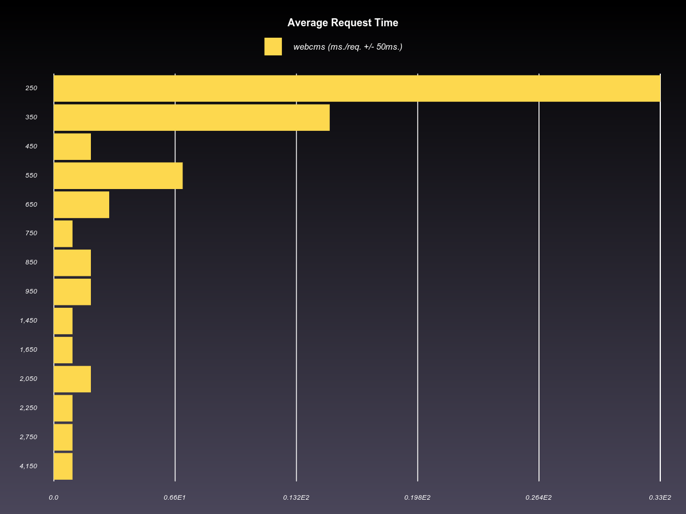
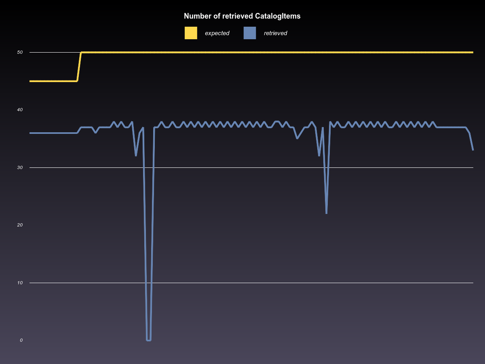

# WebCms Analyzer

WebCms Analyzer parses a log file and generates a few graphs from some
specific lines that are located in the log file.

## Chart examples

## Prerequisites

WebCms Analyzer needs a log file. A suitable example can be found in
[log/production.log](log/production.log).
Lines that contain the following text will be parsed and turned into
data for the charts to be generated:

    [CatalogItem] Retrieved n products, expected m (tms)

## Installing WebCms Analyzer

    gem install bundler
    bundle install

## Run WebCms Analyzer
    ruby -r ./lib/web_cms -e "WebCms('path/to/your/logfile')"
